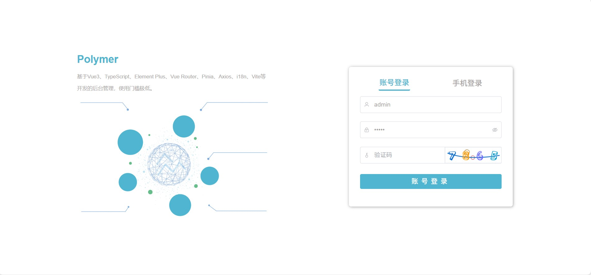
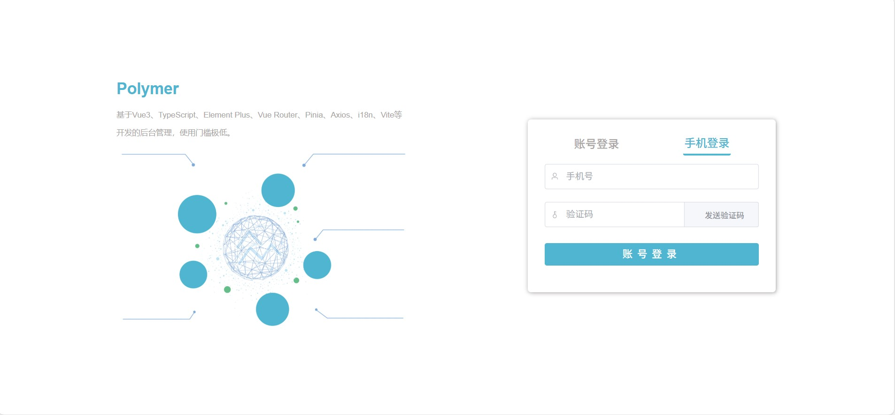
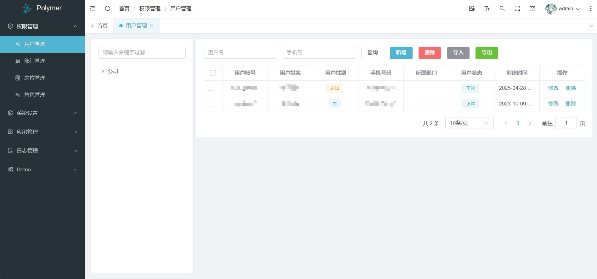
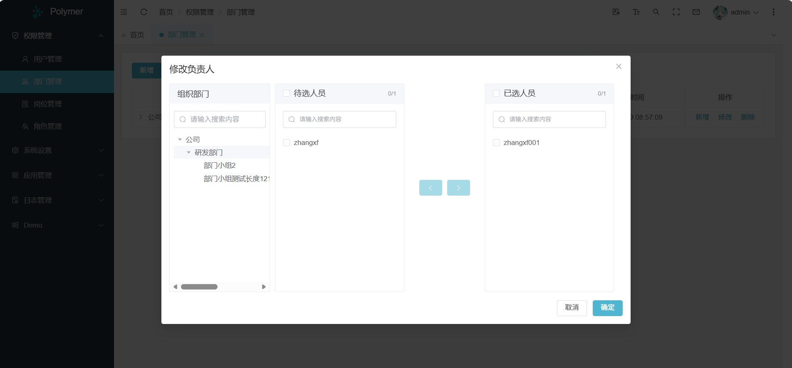
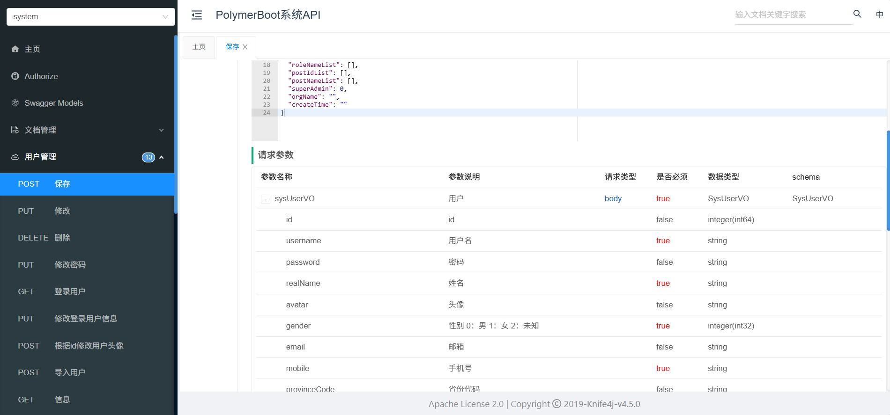
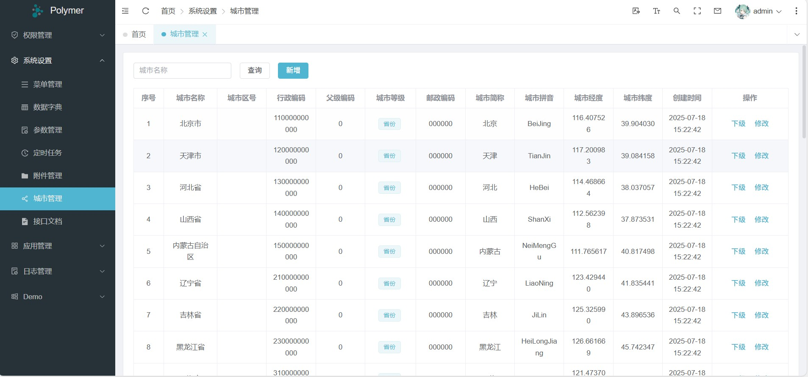
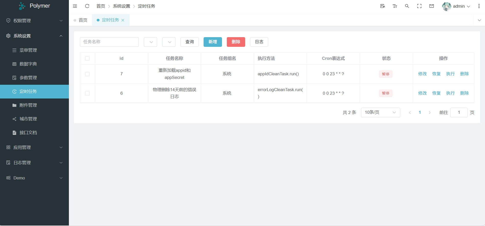
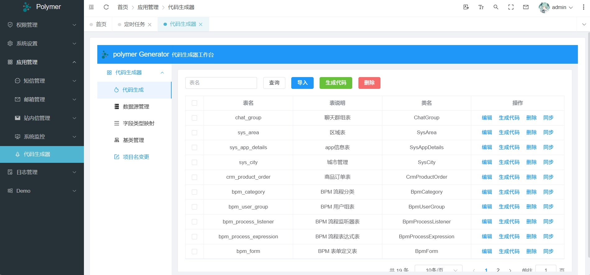

## 平台简介

> polymer
> 采用SpringBoot2.7.18、SpringSecurity6.0、Mybatis、springDoc等框架，
> 开发的一套SpringBoot权限管理开发平台采用组件模式，扩展不同的业务功能，可以很方便的实现各种业务需求，
> 且不会导致系统臃肿，若想使用某个组件，按需引入即可，代码简单规范、易上手、易维护。

## 组织结构

``` lua
polymer
├── polymer-api -- API接口总线模块
|    ├── message -- 系统消息接口
|    ├── storage -- 存储接口
|    ├── system -- 用户权限管理接口
├── polymer-module -- 通用管理模块
|    ├── polymer-module-generator -- 系统代码生成公共模块
|    ├── polymer-module-message -- 系统消息公共模块
|    ├── polymer-module-monitor -- 系统监控公共模块
|    ├── polymer-module-quartz -- 系统定时任务公共模块
|    ├── polymer-module-sequence -- 序列号公共模块
|    ├── polymer-module-storage -- 存储公共模块
├── polymer-business -- 业务管理模块
|    ├── polymer-business-demo -- demo模块
├── polymer-system -- 用户权限管理模块
├── polymer-framework -- 基础框架模块
|    ├── common -- 公共模块
|    ├── encrypt -- 接口传输加密
|    ├── idempotent -- 防止表单重复提交
|    ├── logger -- 操作日志
|    ├── mybatis -- 配置多数据源等
|    ├── ratelimiter -- 限流
|    ├── security -- 权限和认证等
|    ├── web
|    |    ├── client -- 封装统一的，对其他服务请求并捕获异常
|    |    ├── exception -- 异常处理器
|    |    ├── sensitive -- 脱敏
|    |    ├── websocket
|    |    ├── xxs
├── polymer-application -- 启动和测试模块
```

## 框架功能

| 功能         | 描述                                                                                                     |
|------------|--------------------------------------------------------------------------------------------------------|
| 后端项目结构     | 采用插件化 + 扩展包形式 结构解耦 易于扩展                                                                                |
| 后端代码风格     | 严格遵守Alibaba规范与项目统一配置的代码格式化                                                                             | 
| 权限认证       | 采用 SpringSecurity6.0                                                                                   |
| ORM框架      | 采用 Mybatis 2.3.2                                                                                       |
| 数据脱敏       | 采用 注解 + jackson 序列化期间脱敏 支持不同模块不同的脱敏条件<br/>支持多种策略 如身份证、手机号、地址、邮箱、银行卡等 可自行扩展                             |
| 接口传输加密     | 采用 动态 AES + RSA 加密请求 body 每一次请求秘钥都不同大幅度降低可破解性                                                          |
| 接口限流       | 支持默认策略全局限流、根据请求者IP进行限流                                                                                 |
| 发号器        | 支持基于雪花算法，序列号生成器、基于DB取步长，序列号生成器                                                                         |
| 地区管理       | 基于数据库                                                                                                  |
| 离线ip地址     | 基于ip文件（ip2region.xdb）                                                                                  |
| 防重复提交      | 支持前后端防重复提交                                                                                             |
| 多数据源       | 采用 alibaba-druid 注解(Source)动态配置数据源                                                                     |
| 数据库连接池     | 采用 HikariCP Spring官方内置连接池 配置简单 以性能与稳定性闻名天下                                                             |
| WebSocket  | 采用 springframework.web.socket官方内置WebSocket 配置简单;支持按消息类型分发消息                                            |
| SSE消息推送    | Server-Sent Events (SSE) 是HTML5引入的一种轻量级的服务器向浏览器客户端单向推送实时数据的技术，在Spring Boot框架中，我们可以很容易地集成并利用SSE来实现实时通信。 |
| 序列化        | 采用 Jackson Spring官方内置序列化                                                                               |
| 文件存储       | 采用 Minio 分布式文件存储 天生支持多机、多硬盘、多分片、多副本存储<br/>支持权限管理 安全可靠 文件可加密存储                                          |
| 云存储        | 采用 AWS S3 协议客户端 支持 七牛、阿里、腾讯 等一切支持S3协议的厂家,支持预签名前端支持                                                     |
| 短信         | 采用 Alibaba 短信模板发送                                                                                      |
| 邮件         | 通用协议支持大部分邮件厂商                                                                                          |
| 站内通知       | 可以进行内部消息通知                                                                                             |
| 接口文档       | 采用 SpringDoc、javadoc 无注解零入侵基于java注释<br/>只需把注释写好 无需再写一大堆的文档注解了                                          |
| 校验框架       | 采用 Validation 支持注解与工具类校验                                                                               |
| Excel框架    | 基于poi插件化<br/>框架对其增加了很多功能 例如 自动合并相同内容 自动排列布局 字典翻译等                                                      |
| 代码生成器      | 只需设计好表结构 一键生成所有crud代码与页面<br/>降低80%的开发量 把精力都投入到业务设计上<br/>框架为其适配MP、SpringDoc规范化代码 同时支持动态多数据源代码生成         |
| 国际化        | 基于请求头动态返回不同语种的文本内容 开发难度低 有对应的工具类 支持大部分注解内容国际化                                                          |
| 代码单例测试     | 提供单例测试 使用方式编写方法与maven多环境单测插件  <br/>                                                                    |
| 暴露接口统一签名验证 | 采用注解方式、springmvc 拦截器实现，针对不同app采用不同的密钥，使用添加注解@SignatureCheck                                            |
| 调用其他服务统一工具 | 采用RestTemplate实现，统一自定义异常捕捉                                                                             |
      
## 代码生成器

1. 只启动后端，可以直接访问地址：http://localhost:8081/polymer/generator/index.html
2. 前后端都启动，菜单：应用管理=》代码生成器，进行访问

## 接口文档

1. 只启动后端，可以直接访问地址：http://localhost:8081/polymer/doc.html
2. 前后端都启动，菜单：系统设置=》接口文档，进行访问

## 管理账号

* admin/admin

## 演示图

<table>
   <tr>
      <td></td>
   </tr>
   <tr>
      <td></td>
   </tr>
   <tr>
      <td></td>
   </tr>
   <tr>
      <td></td>
   </tr>
   <tr>
      <td></td>
   </tr>
   <tr>
      <td></td>
   </tr>
   <tr>
      <td></td>
   </tr>
   <tr>
      <td></td>
   </tr>
</table>

